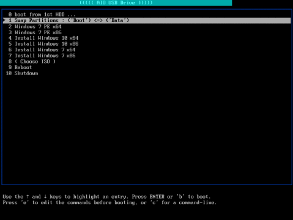
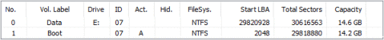
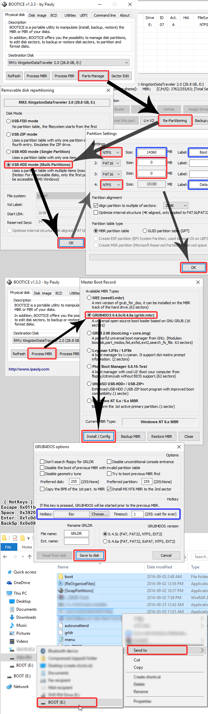

# HBoot

A tool to enable you boot directly from multiple ISO files on a USB stick.

No need anymore for [Windows USB/DVD Download Tool](https://www.microsoft.com/en-us/download/windows-usb-dvd-download-tool), which is great tool, but eventually extracts the Windows ISO making your USB stick unusable for any other OS installation (Ubuntu or even different other Windows ISO) or even for decent personal files.

Using this tool you can have a USB stick divided into 2 partitions (Boot + Data) so you can still use the Data partition for personal storage. And even in the Boot partition will not be packed with multiple files as the ISO files are directly copied.

Once this tool is setup on a USB stick, you can copy any/all of the following ISO files, then boot from any of them:

- [ubuntu-20.04-desktop-amd64.iso](https://releases.ubuntu.com/20.04/ubuntu-20.04-desktop-amd64.iso)
- [Win10_1909_English_x64.iso](https://www.microsoft.com/en-us/software-download/windows10ISO/)
- [Win10_1909_German_x64.iso](https://www.microsoft.com/en-us/software-download/windows10ISO/)
- [Win7PE_x64.iso](https://archive.org/download/win7pe-x64/Win7PE_x64.iso) (see [screenshots](https://archive.org/details/win7pe-x64))

**Screenshot of the boot menu**

It relies on [GRUB Legacy (0.97)](https://www.gnu.org/software/grub/grub-legacy.html).

## Overview

A brief explanation of:

### “multi-partition”

USB disk will have 2 partitions:

- NTFS partition for all “Boot” files (ISO files, grldr, firadisk, …)
- NTFS partition for regular “Data” usage
- Windows OS allows access to only one partition for any removable device. So, making the “Data” partition accessible (visible) to Windows ensures security to all boot files (the entire “Boot” partition is hidden). Even if anyone tried to format your USB disk using regular windows format, it will format only the visible partition.

So, your boot files are protected as long as you set the “Data” partition as the visible one.

### “multi-boot”

USB disk can boot from the following:

- Windows XP/7/10 installation ISO (you can install any version of windows)
- Windows PE (Preinstalled Environment) ISO
- Ubuntu ISO (i.e: live/installation)
- Hiren’s BootCD ISO
- Ultimate BootCD ISO
- Acronis Disk Director ISO
- Acronis True Image ISO
- Norton Ghost (2003/v15) IMG/ISO
- and possibly more …

## Technical details

- The **grub4dos** will be written to the MBR of the USB disk to boot from “**grldr**” file that exists at root of any partition.
- The “**menu.lst**” file is pre-configured and categorized based on existing ISO files. Recognized ISO’s are loaded directly. Unrecognized ISO’s are loaded through the boot choice “**( Choose ISO )**” which loads “**boot/menuISOFileList.lst**“.
- The “**boot/menuISOFileList.lst**” file is automatically generated by “**.[ReOrganizeFiles].bat**“, ideally.
- USB disk partition table will be like:
  
- Swapping/switching partitions can be done from booting options (thanks to [Steve](http://reboot.pro/topic/18610-grub4dos-setptn1g4b-batch-file-sets-a-primary-partition-as-1st-entry/)).
- “**.[SwitchPartitions].bat**” uses an embedded “**.BOOTICE.exe**” to modify partition table by setting parameter `/firstpart=1`.

## Steps

**CAUTION:**
Make sure your USB disk has no important data.
You take full responsibility of any data loss or HDD damage resulting from the following steps.
**However**, if you followed the guide in a step-by-step manner, no data should be lost.
DO NOT CONTINUE IF YOU DO NOT KNOW WHAT YOU ARE DOING.

1. Clone the “**HBoot-Files**“ (this repository)
2. Using “**BOOTICE.exe**” (in “**HBoot-Tools.zip**“), follow the screenshot below (blue marks are optional/changeable):

   

3. Copy the ISO files to the boot partition

   (preferable by _dragNdrop_ over “**.[ReOrganizeFiles].bat**“)

   (download links can be found at the beginning of “**menu.lst**“)

4. Run “**.[ReOrganizeFiles].bat**” to ensure ISO contigousiness (i.e: defragemented) & to protect boot files.

## Notes

- Using “**.[SwitchPartitions].bat**” you can switch/swap between “Boot” and “Data” partitions.

  You can switch also using “BOOTICE” => “Parts Manage” => “Set Accessible”

- Using “**.[ReOrganizeFiles].bat**” you can:
  - Copy files **contiguously** (if possible) by opening/dragging-dropping them with the “**.[ReOrganizeFiles].bat**” file.
  - Verify that all **ISO** files are **contiguous** (must be so, to boot).
  - Hide/protect critical boot files & show/unhide all other files (useful in case of some malware infection).
  - Remove (from root folder only) :
    - shortcut files (\*.lnk)
    - vbScript files (\*.vbs)
    - JavaScript files (\*.js)
    - “Autorun.inf” file created by some malwares
    - “System Volume Information” folder
    - “Recycler” folder
    - “RECYCLE” file/folder created by some malwares
  - Rebuild “**Autorun.inf**” file for elegant USB icon (also overwrites the inf file created by some malwares)
- Any ISO file must be placed at the root of the “Boot” partition.
- Some ISO files are pre-configured for booting, to make use of this, ISO file name should be as configured in “**menu.lst**” (for advanced users)

I hope this would be useful to someone.

Good Luck 😉

### Hint:

This _tutorial_ was used to be a [blog post](https://hossam6236.wordpress.com/2016/09/03/hboot-multi-partition-multi-boot-from-iso-files-usb-install-windows-7-10-windowspe-boot-iso/) since 2016, but is moved to a git repo for:

- tracking changes of `menu.lst` due to new releases of Windows and Ubuntu
- easier maintenance of files here than google drive

Reference/technical links:

- https://wiki.archlinux.org/index.php/GRUB_Legacy
- https://gparted.org/display-doc.php?name=help-manual&lang=C#gparted-fix-grub-boot-problem
- http://mirrors.kernel.org/ubuntu/pool/main/g/grub/grub_0.97-29ubuntu66_amd64.deb
- https://help.ubuntu.com/community/Grub2/ISOBoot
- https://wiki.archlinux.org/index.php/Multiboot_USB_drive
- https://opensource.com/article/16/11/managing-devices-linux
- https://help.ubuntu.com/community/Grub2/Upgrading#Reverting_to_GRUB_Legacy
- https://www.rmprepusb.com/tutorials/grub4dos/grub4dos-internal-variables-and-functions
- https://thestarman.pcministry.com/asm/mbr/GRUB.htm

Links for GRUB2 upgrade:

- Install: https://unix.stackexchange.com/a/36823
- Config: https://askubuntu.com/questions/367011/boot-windows-7-iso-from-grub2
- No file writing:
  - https://askubuntu.com/a/83279
  - https://www.gnu.org/software/grub/manual/grub/grub.html#Environment-block
- https://www.aioboot.com/en/
- using wimboot in grub2 for win iso: https://www.rmprepusb.com/tutorials/145-grub2winiso
- `rsync`

## TODO

- create similar installer for windows … using BootICE cli: see [this](http://reboot.pro/topic/21271-how-to-use-bootice-creat-two-partitions-command-line/) and [this](https://www.portablefreeware.com/forums/viewtopic.php?t=20478), then move tutorial to sub md file
- check/use `rsync` and its windows equivalent
- unify both installers interface and rename to **HBoot installer**
- cleanup unused files/tools: boot/BCD, …
- move windows-specific tools to own dir: `init-windows-tools`
- update windows_product_keys.txt file and ensure it is loaded, like in grub2 branch
- in GRUB2 branch:
  - load Windows ISO (again)… using memdisk (slow) AND chainloader/whatever
  - finalize the menu items in `grub.cfg`
