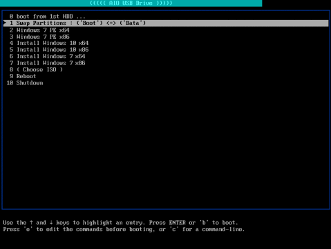

# HBoot

A tool to enable booting directly from USB stick containing multiple ISO files.

## Benefits

Using this tool you can have a USB stick divided into 2 partitions (Boot + Data) so you can still use the Data partition for personal storage. And even in the Boot partition will not be packed with multiple files as the ISO files are directly copied.

Once this tool is setup on a USB stick, you can copy any/all of the following ISO files, then boot from any of them:

- [ubuntu-20.04-desktop-amd64.iso](https://releases.ubuntu.com/20.04/ubuntu-20.04-desktop-amd64.iso)
- [Win10_1909_English_x64.iso](https://www.microsoft.com/en-us/software-download/windows10ISO/)
- [Win10_1909_German_x64.iso](https://www.microsoft.com/en-us/software-download/windows10ISO/)

**Sample screenshot of the boot menu**

It currently relies on [GRUB Legacy/0.97](https://www.gnu.org/software/grub/grub-legacy.html) (**GR**and **U**nified **B**oot loader).

### What it replaces

No need for [Windows USB/DVD Download Tool](https://www.microsoft.com/en-us/download/windows-usb-dvd-download-tool), which is a great tool, but eventually extracts the Windows ISO making your USB stick unusable for any other OS installation (Ubuntu or even different other Windows ISO) nor even convenient for personal usage.

Also there are other tools, some of them are great, but lack some important features (as far as I have found), because they either extract the ISO content or limited to Linux distros (no windows). Some of these tools are: [UNetbootin](https://www.pendrivelinux.com/using-unetbootin-to-create-a-linux-usb-from-linux/), [MultiBsootUSB](http://multibootusb.org/page_guide/), [Rufus](https://rufus.ie/), [YUMI](https://www.pendrivelinux.com/yumi-multiboot-usb-creator/)… etc. Using `HBoot`, there is no need for them as well.

## Setup: using installer

1. Based your OS, choose from

   - `install/install-ubuntu.sh`
   - `install/install-windows.bat`

   then run it, either:

   - **without arguments**: i.e: run/open the installer directly.

     It will prompt for couple of inputs, then confirmation.

   - or **with arguments**: No prompt, only confirmation.

     - on Ubuntu, using BASH:
       - `install/install-ubuntu.sh [TARGET_DEVICE] [BOOT_SIZE_GB=18]`
       - Example: `install/install-ubuntu.sh /dev/sdd 15`
     - on Windows, using CMD:
       - `install/install-windows.bat [TARGET_DEVICE] [SIZE_BOOT_GB=17]`
       - Example 1: `install/install-windows.bat E: 17`
       - Example 2: `install/install-windows.bat 1 17`

   **_Note_: In the installer**: make sure the shown information are as expected, then proceed the confirmation.

2. Copy all the HBoot files and folder (this whole repo), to the USB storage's boot drive.

3. Copy any (or all) of the follwing ISO files to `iso/` directory:

   - [ubuntu-20.04-desktop-amd64.iso](https://releases.ubuntu.com/20.04/ubuntu-20.04-desktop-amd64.iso)
   - [Win10_1909_English_x64.iso](https://www.microsoft.com/en-us/software-download/windows10ISO/)
   - [Win10_1909_German_x64.iso](https://www.microsoft.com/en-us/software-download/windows10ISO/)

4. Run `iso/verify-iso.sh` (or `iso/verify-iso.bat` on Windows), to make sure that the ISO files are possible to boot from.

## Setup: manual

- on Windows: using [`BOOTICE`](./tools/BOOTICE.exe), follow along [this tutorial](./doc/tutorial-windows.md).

- on Ubuntu:

  - use the "Disks" manager, `gparted`, or `parted` for partitioning
  - not yet known a solid way for `GRUBLegacy` installation on Ubuntu 12.04 or later, except for restoring a backup bin file.

    A full backup file can be found in `install/grub_mbr`, which is of exact size of **9216 bytes** including the MBR and few more bytes afterwards.

    Be aware that restoring 9216 bytes, _overwrites_ not only the [MBR](https://en.wikipedia.org/wiki/Master_boot_record) (first 440 bytes), but also the PartitionTable, disk signature.

    The [PartitionTable](https://thestarman.pcministry.com/asm/mbr/PartTables.htm) alongside disk signature should be existing on the disk in bytes `441 to 512`. Also cloned, specifically for GRUBLegacy, to bytes `952(or 512+440) to 1024`, see [this page](https://thestarman.pcministry.com/asm/mbr/GRUB.htm) for thorough explanation of the first 512 bytes of GRUBLegacy.

## TODO

- create installer for windows (like ubuntu one) … using BootICE cli: see [this](http://reboot.pro/topic/21271-how-to-use-bootice-creat-two-partitions-command-line/) and [this](https://www.portablefreeware.com/forums/viewtopic.php?t=20478), then move tutorial to sub md file
- check/use `rsync` and its windows equivalent
- move verify-iso.bat/sh to iso/ dir ? (but it updates .menuISOFileList.lst … => update it in the installer ?)
- in GRUB2 branch:
  - load Windows ISO (again)… using memdisk (slow) AND chainloader/whatever
  - finalize the menu items in `grub.cfg`

## References

Ref links for GRUBLegacy

- https://wiki.archlinux.org/index.php/GRUB_Legacy
- https://gparted.org/display-doc.php?name=help-manual&lang=C#gparted-fix-grub-boot-problem
- http://mirrors.kernel.org/ubuntu/pool/main/g/grub/grub_0.97-29ubuntu66_amd64.deb
- https://help.ubuntu.com/community/Grub2/ISOBoot
- https://wiki.archlinux.org/index.php/Multiboot_USB_drive
- https://opensource.com/article/16/11/managing-devices-linux
- https://help.ubuntu.com/community/Grub2/Upgrading#Reverting_to_GRUB_Legacy
- https://www.rmprepusb.com/tutorials/grub4dos/grub4dos-internal-variables-and-functions
- https://thestarman.pcministry.com/asm/mbr/GRUB.htm

Links for GRUB2 upgrade

- Install: https://unix.stackexchange.com/a/36823
- Config: https://askubuntu.com/questions/367011/boot-windows-7-iso-from-grub2
- No file writing:
  - https://askubuntu.com/a/83279
  - https://www.gnu.org/software/grub/manual/grub/grub.html#Environment-block
- https://www.aioboot.com/en/
- using wimboot in grub2 for win iso: https://www.rmprepusb.com/tutorials/145-grub2winiso
- `rsync`

